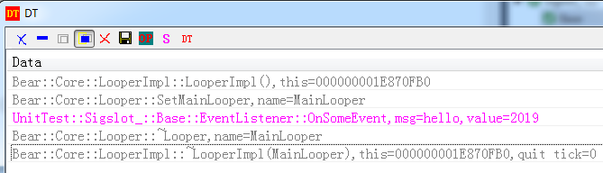

# Event,Message and sigslot 事件,消息和信号槽
事件，消息，或者还有一个名称叫信号(不是指linux中的signal,而是类似QT中的信号)，是很容易混淆的概念，这也可以理解，严格区分这些术语对实现来说并没有太大的意义,它们的本质都是数据调用传递,本着实用为王的态度，本文对这些术语不作刻意区分。

## 消息框架设计

CoreLooper深受Android和Windows影响，所以同时仿照实现了它们的消息接口，是在Handler类中实现的。由于Looper是Handler子类，所以这些接口也可用于Looper。  

```cpp
//windows消息结构主要成员如下
struct  tagMSG
{
UINT msg;
WPARAM wp;
LPARAM lp
//...
};
```
msg是个无符号整数,用来标识消息，而wp和lp分别两个指针类型的参数，可以传整数或者地址。
这个结构很简单，所以CoreLooper没再封装，而是在接口中直接传这3个参数。  

这里附带说一下，网上有些人说Windows总是很奇葩，明明C语言自带的数据类型很方便，非要搞一些莫名其妙的UINT,WPARAM和LPARAM之类的类型宏。在我看来这才是Windows的精妙之处,通过这些宏，Windows API从16bit,32bit到64bit时代一路过来，历经30多年核心API一直保持原型不变。这些人不考虑历史原因和实际情况，一味指责,可能是梁静茹给了他们太多勇气?  

```cpp
//仿android message
class Message:public Object
{
public:
	LONGLONG	what = 0;
	LONG_PTR	arg1 = 0;
	LONG_PTR	arg2 = 0;
	shared_ptr<Bundle> mBundle;
	shared_ptr<Object> mObject;
};
```
what类似windows消息中的msg  
arg1和arg2类似widnows消息中的wp和lp  
作为更加时尚的OS,android的消息可以通过Bundle传多个参数，甚至可以传入Objecvt对象。  

初看起来android消息更加强大一些，但这只是表象。CoreLooper内部是采用类Windows消息封装来实现类android message。 

另外，java中有个简洁好用的Runnable，所以也引入到CoreLooper中。


## 同步发送消息
同步是指发送消息后，要等待接收方响应处理完消息，然后才返回发送方
```cpp
	//windows style
	virtual LRESULT LOOPER_SAFE sendMessage(UINT msg, WPARAM wp = NULL, LPARAM lp = NULL);

	//android style
	virtual LRESULT LOOPER_SAFE sendRunnable(shared_ptr<Runnable> obj);
	virtual LRESULT LOOPER_SAFE sendMessage(shared_ptr<Message> message);
	//注意android sendMessage是异步的，即不等待响应就返回,这点是反直觉的，所以CoreLooper下此接口是同步的，需要等待响应才返回
	
```

值得说明的是，在等待接收方响应消息期间，发送方所在Looper仍然能响应其他Looper发来的消息，这是个很关键的功能，否则容易死锁，举例如下:  
LooperA发消息message1给LooperB  
LooperB在处理消息message1期间要发消息message2给LooperA  
而此时LooperA在等待LooperB对message1的回复  
如果LooperA在等待时不能响应新收到的消息，则出现死锁了。

CoreLooper的众多功能中，这个功能困扰我的时间是最长的。直到2016年才在liblingle中找到解决办法，原来用一个bool变量就能搞定了,真是大道至简。如果能早点研究liblingle,CoreLooper可以提前好几年面世。


## 异步投递消息

异步投递是指发送消息后，不需要等待接收方响应，发送方直接执行后续指令。  


```cpp
//windows style
virtual LRESULT LOOPER_SAFE postMessage(UINT msg, WPARAM wp = NULL, LPARAM lp = NULL);
```

```cpp
//android style
	virtual LRESULT LOOPER_SAFE postMessage(shared_ptr<Message> message);
	virtual LRESULT LOOPER_SAFE postRunnable(shared_ptr<Runnable> obj);
	virtual LRESULT LOOPER_SAFE postDelayedRunnable(shared_ptr<Runnable> obj, UINT ms);

```

## sigslot信号槽(事件侦听与触发)

sigslot是个很好用的信号槽机制。  

sigslot本身是支持多线程安全的，但CoreLooper只使用了其中的单线程，原因主要是: sigslot是集成在Handler里的，不想给每个Handler内置一个锁,尽量少用锁是CoreLooper的原则。

sigslot支持0到8个参数，分别用signal0,signal1...signal8  
现采用单元测试来演示事件侦听和触发  

```cpp
//TEST_CLASS(Sigslot_).TEST_METHOD(Base)
class EventSource :public Handler
{
	SUPER(Handler)
public:
	sigslot::signal3<Handler*, const string&, int> SignalSomeEvent;

protected:
	void OnCreate()
	{
		__super::OnCreate();

		class Worker :public Runnable
		{
		public:
			weak_ptr<EventSource> mObject;
		protected:
			void Run()
			{
				auto obj = mObject.lock();
				if (obj)
				{
					obj->SignalSomeEvent(obj.get(), "hello", 2019);
				}
			}
		};

		auto obj = make_shared<Worker>();
		obj->mObject = dynamic_pointer_cast<EventSource>(shared_from_this());
		postDelayedRunnable(obj, 1000);
	}

};
class EventListener :public Handler
{
	SUPER(Handler)
public:
	void OnSomeEvent(Handler*, const string& msg, int value)
	{
		DW("%s,msg=%s,value=%d", __func__, msg.c_str(), value);

		Looper::CurrentLooper()->PostQuitMessage(0);
	}
};

class MainLooper :public MainLooper_
{
	SUPER(MainLooper_);

	void OnCreate()
	{
		__super::OnCreate();

		auto source = make_shared<EventSource>();
		AddChild(source);

		auto listener = make_shared<EventListener>();
		AddChild(listener);

		source->SignalSomeEvent.connect(listener.get(), &EventListener::OnSomeEvent);
	}
};
make_shared<MainLooper>()->StartRun();
```

简要说明如下:  
- EventSource提供SignalSomeEvent事件源，原型是void (Handler*, const string&, int)  
注意sigslot事件响应原型的返回值都是void,如有需要，可以通过参数来返回数据  
- EventListener 按EventSource事件源，实现函数	void OnSomeEvent(Handler*, const string& msg, int value)
- 侦订source->SignalSomeEvent.connect(listener.get(), &EventListener::OnSomeEvent);
- 触发 obj->SignalSomeEvent(obj.get(), "hello", 2019);
- 触发事件时，sigslot会调用EventListener中的函数

注意sigslot中事件源和事件响应可以是多对多的关系。   即一个事件源可多次被侦听，同一listener也可侦听多个事件源。

执行后DT显示如下  

