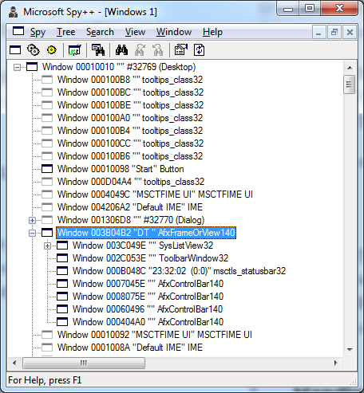

# Handler
Handler是CoreLooper框架管理的基本对象，类似于Android中的Handler,MFC中的CWnd和win32中的HWND
Handler可以使用timer,在同一looper和跨looper sendMessage或者postMessage,侦订其他Handler的消息

## Handler生命周期


### 创建Handler
采用两段式来创建Handler,
- 第一段是c++语言层面上的创建,即new语义
  Handler必须在heap中创建，不能在stack中创建
  强烈建议采用make_shared来创建c++对象，不要直接调用new,一个new也不要，也不要调用delete,而是全部采用smart pointer来管理

- 第二段是框架层面上的创建,即绑定到Looper，构建parent/child关系
 Handler只能在Looper环境下创建,并且必须绑定到Looper后才能正常使用
框架接口如下
```cpp
virtual void LOOPER_SAFE Create(shared_ptr<Handler> parent);
virtual int LOOPER_SAFE AddChild(weak_ptr<Handler> child, string name = "");
```
有如下几种典型用法
```cpp
auto obj=make_shared<Handler>();
//此时Handler还没有绑定到Looper,可在Handler构造或者此处传初始化参数
obj.Create(parent);
```
或者更简单一点，在不需要初始化时
```cpp
parent.AddChild(make_shared<Handler>());
```
如果是在父类中调用(一般是在父类.OnCreate)，则可以简化为
```cpp
AddChild(make_shared<Handler>());
```
说明:
- Handler支持跨looper创建,比如在MainLooper中创建Handler然后绑定到WorkLooper中
- 只有绑定到Looper之后,handler才能使用框架提供的功能，比如timer,sendMessage,postMessage等


### 销毁Handler
```cpp
virtual void LOOPER_SAFE Destroy();
```
采用Handler.Destroy()来销毁Handler,会在Handler绑定的Looper中调用OnDestroy()
app可以多次调用Handler.Destroy()，不会引起错误或不良影响，由框架保证OnDestroy()会被调用并且只被调用一次

销毁和析构是不同的概念
销毁是本框架定义的，析构是c++语言定义的

说明:
- 销毁不影响timer,sendMessage和postMessage等功能，这些功能在销毁后仍然可用
- 销毁后此Handler不能再次Create或者AddChild
- parent销毁时会自动递归销毁其所有的child,依此类推
- parent已销毁时，如果再向它AddChild,此时child能正常创建，但马上自动销毁

### 析构
当Handler的最后一个shared_ptr失效时会调用析构

#### Handler析构函数在哪个Looper被调用
- 如果只在绑定的Looper内使用Handler,则会在此Looper中析构Handler
- 如果跨Looper使用另一Looper中的shared_ptr< Handler>,并且在Handler.Destroy()后仍然保持此shared_ptr,则有很低的几率跨Looper析构Handler
#### 跨Looper析构Handler详解和解决办法
当调用Handler.Destroy()后,其原生Looper保留一个shared_ptr< Handler>并加到gc(垃圾回收)并且马上检查回收。
另外，当gc列表有项目时Looper会定时检查回收。

回收算法如下
1. 先用weak_ptr引用此Handler
2. 清除shared_ptr< Handler>
3. 对weak_ptr进行lock(),如果为nullptr,说明Handler已析构;如果不为nullptr,说明有外界引用,Handler要重新加到gc列表

假定:
LooperA在gc中引用了HandlerA,
 LooperB用shared_ptr也引用了HandlerA
当LooperA运行完上面第2步,但还没运行第3步，
此时在LooperB中清除它引用的shared_ptr< HandlerA>,则会在LooperB中析构HandlerA

尽管几率很小，这个竞争在框架层面和c++语言层面都没法消除。  
最好的解决办法是由app保证自定义的Handler子类能支持跨looper析构。
框架本身的Hanlder是跨Looper析构安全的。

 所以: ** todo ** 框架要提供接口来方便app测试跨Looper析构Handler，增加安全性。

####  析构总结
框架基本可保证在绑定的Looper中析构Handler(极端情况除外)
框架保证Handler自身跨线looper析构是安全的,app自定义的Handler子类只能由app自行保证
解决办法很简单,Handler.OnDestroy()始终是在绑定的Looper中调用的,Handler子类只需要在OnDestroy()中清理即可。

## Handler结构树
Handler结构树类似下图中的Windows窗口树



如上图所示,SPY++中树形控件中每个节点都是一个HWND窗口,根节点是桌面窗口  
在CoreLooper中也有类似的结构树，根节点是MainLooper  
parent.AddChild或obj.Create就是把节点挂载到上级节点,由于在CoreLooper中Looper是Handler子类，所以节点可以是普通的Handler,也可以是Looper。  

采用树形结构来管理所有对象有很多好处
todo:节点用法,ajax,proc,shortcut

## 定时器 Timer
``` cpp
	virtual long SetTimer(long& timerId, UINT interval);
	virtual long KillTimer(long& timerId);
	virtual void OnTimer(long timerId);
```

框架内部采用时间轮管理timer
创建，销毁和触发timer的复杂度可认为是O(1),可轻松管理几百万个timer

### SetTimer
在调用Handler.Create或者.AddChild创建Handler之后，就可以调用SetTimer来创建定时器
参数:
- timerId:输入&输出参数,0为无效值,当传入非0的timerId时,SetTimer会先销毁此timer,再创建并返回新的timerId
- interval为输入参数，表示间隔时间，单位:毫秒,最小精度为1ms,传0时会默认取1ms,实际触发OnTimer的精度取决于OS

### KillTimer
当不再需要定时器时，可调用KillTimer来销毁

Timer的补充说明:
- 当Handler析构时会自动销毁此Handler创建的所有定时器
- Handler.Destroy()不影响timer

### OnTimer
```cpp
virtual void OnTimer(long timerId);
```

## 关于LOOPER_SAFE
采用LOOPER_SAFE修饰的接口可以安全的跨looper调用
没有采用LOOPER_SAFE修饰的接口，不保证跨looper安全调用，应该只在handler所在looper里调用


## 关于SUPER和__super
__super是Windows VC++扩展的关键字，能很方便的调用父类方法，使用非常方便。  
其他编译器都不支持__super,所以CoreLooper框架增加了SUPER宏来增加此功能。

典型用法
```cpp
		class MainLooper :public MainLooper_
		{
			SUPER(MainLooper_)
			void OnCreate()
			{
				__super::OnCreate();
			}
		};

```
好处是可以让所有平台都支持__super::OnCreate这样的调用方法了


# Handler接口
```cpp
	virtual void LOOPER_SAFE Create(shared_ptr<Handler> parent);
	virtual void LOOPER_SAFE Destroy();

	//windows style
	virtual LRESULT LOOPER_SAFE sendMessage(UINT msg, WPARAM wp = NULL, LPARAM lp = NULL);
	virtual LRESULT LOOPER_SAFE postMessage(UINT msg, WPARAM wp = NULL, LPARAM lp = NULL);

	//android style
	virtual LRESULT LOOPER_SAFE sendRunnable(shared_ptr<Runnable> obj);
	virtual LRESULT LOOPER_SAFE postRunnable(shared_ptr<Runnable> obj);
	virtual LRESULT LOOPER_SAFE postDelayedRunnable(shared_ptr<Runnable> obj, UINT ms);
	virtual void    LOOPER_SAFE cancelRunnable(shared_ptr<Runnable> obj);
	virtual LRESULT LOOPER_SAFE sendMessage(shared_ptr<Message> message);
	virtual LRESULT LOOPER_SAFE postMessage(shared_ptr<Message> message);

	virtual long SetTimer(long& timerId, UINT interval);
	virtual void KillTimer(long& timerId);

	virtual int LOOPER_SAFE AddChild(weak_ptr<Handler> child, string name = "");
	shared_ptr<Handler> LOOPER_SAFE GetParent()const;
	string LOOPER_SAFE GetUrl()const;
	virtual LONG_PTR LOOPER_SAFE GetId()const;
	virtual void LOOPER_SAFE SetId(LONG_PTR id);

	string LOOPER_SAFE GetObjectName()const;
	void LOOPER_SAFE SetObjectName(const string& name);

	bool LOOPER_SAFE IsLooper()const;
	virtual shared_ptr<Handler> LOOPER_SAFE FindObject(string url);
	virtual shared_ptr<Handler> LOOPER_SAFE GetChild(LONG_PTR id);
	
	int LOOPER_SAFE RegisterShortcut(const string& name, weak_ptr<Handler> obj);
	shared_ptr<Handler> LOOPER_SAFE Shortcut(const string& name);


```

## 绑定
为充分发挥CoreLooper框架的威力，Handler在创建后都应该添加结构树上面,我们把这称为绑定。


##  生命周期管理
在c++已有构造函数和析构函数的情况下，为了统一和简化框架流程，CoreLooper另外增加了Create,Destroy这两个框架层面的状态来辅助管理Handler对象的生命周期。简单来说，就是经典的两段式构造和销毁,这在Windows.MFC,ios.objectc,ios.swift,android接口中随处可见。

据说QT的对象在构造函数中就可以调用SetTimer等接口，这点感觉比较好用。为此，在设计CoreLooper时，曾经花较多时间研究，最终发现不太好，主要是实现的不简洁自然，比较别扭，与CoreLooper设计理念冲突。另外有一些地方做起来会有缺陷，比如说基类在构造函数中是没法调用子类的虚函数。

综上所述，CoreLooper采用的是两段式构造，构造函数中只做最基本的初始化,增加了Create接口，它会触发Handler.OnCreate,其他比较"重"的功能都应该在OnCreate中来做。

### Create
典型用法是在parent的OnCreate()中调用如下代码
```cpp
	auto obj=make_shared<DemoHandler>();
	obj->Create(parent);
```
或者更简单：
```cpp
	AddChild(make_shared<DemoHandler>());
```
AddChild内部会检测并在需要时自动调用obj->Create()

Create()会触发OnCreate()
框架保证会在Handler原生Looper中调用Handler.OnCreate,并且仅调用一次


### Destroy

Destroy()会触发OnDestroy()
框架保证会在Handler原生Looper中调用Handler.OnDestroy,并且仅调用一次

## 关于shared_ptr循环引用

在CoreLooper框架内部,parent对child做weak_ptr,child对parent做shared_ptr

有时基于性能，使用便捷等原因，parent可能缓存child的shared_ptr,从而形成shared_ptr循环引用。这样使用完全正常，也合情合理。只需要注意一点,在parent OnDestroy中要记得清除对child的shared_ptr。

有时同级handler之间也有类似用法。解决办法都一样

此场景的最佳做法如下  
在OnCreate()中缓存shared_ptr  
在OnDestroy()中清除shared_ptr


前方高能,有一个小坑需要注意。细节分析如下:
调用Destroy()之后CoreLooper保证马上调用并仅调用一次OnDestroy(),  
此时，如果app层没有对此Handler的shared_ptr,则CoreLooper马上析构Handler  
如果app代码中还有此Handler的shared_ptr,CoreLooper检测到不能马上析构Handler,会把它加到gc检测表中并定时重试析构,在最终析构之前,此handler的框架功能，比如timer,message都是正常工作的，如果在此阶段构成循环引用，只能由app自行处理了。
最好的办法是回避，或者是保证仅在OnCreate()中出现循环引用。

