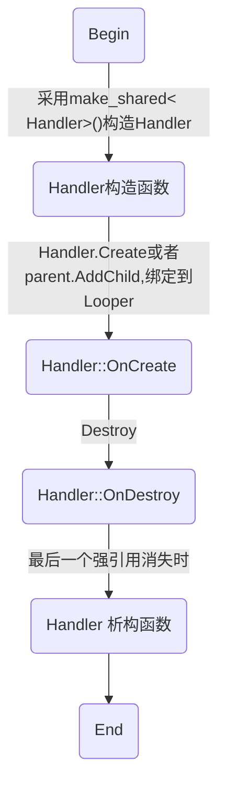

# todo 
 简介文档不要讲太多细节，避免把读者吓跑
 细节留在设计文档中讲，仅供有兴趣的用户深入研究
# CoreLooper简介
CoreLooper是一个基于c++11的通用组件框架,支持通用业务和网络通讯。

- 框架是什么
简单来说,框架是一套可扩展，可重用的软件组件。一般是为了简化和规范某一方面的软件开发而设计。
框架可分为通用框架和专用框架。
通用框架不针对具体的业务，一般只实现最基本的功能，能适用于很多场合。
专用框架则往往专注于某个细分领域，针对性很强。
可以在通用框架的基础上构建专用框架。
- 使用框架有什么好处
用一句话就可以讲清楚:框架处理繁琐的通用细节问题，让用户集中精力处理应用层业务。

## CoreLooper主要特点
开源界已经有众多网络框架,比如ace,asio,evpp,libevent,libuv,libev,muduo,但CoreLooper有与众不同的地方
- 提供通用完备的基础设施，不仅仅局限于网络应用
- 不依赖其他库, 仅基于c++11(只用到shared_ptr,weak_ptr,auto等少量c++11特性)
- 支持Android, iOS, Linux, Windows(x86/x64),可移植到其他平台
- 具有无限扩展性
 比如可轻松实现所有设计模式,采用类java风格实现java开源库的功能，比如netty,eventbus,spring等
- 解决了多平台支持的难题
  CoreLooper对所有平台都提供统一的接口，用户不需要关心每个平台的细节
- 解决了thread粒度太大不好控制的问题
   现在很少有软件是单线程的，为此各系统都提供了创建线程的接口，问题在于在c++层面，这个接口过于简陋。以pthread_create为例,它只需要提供一个线程入口函数ThreadFunc，看起来比较适合一条道跑到头。而在实际的业务中，线程经常需要和其他线程交互
- 解决了组件跨线程通讯难题
 通过sendMessage和postMessage,多个线程中的组件可互相发送消息安全通讯 
- 解决了组件需要加锁才能保证线程安全的问题
 在多线程应用中，不同线程中的组件经常需要互相调用，为了保证线程安全，经常需要加锁同步，所以在一般的app源码中可以看到大量的加锁调用。
这其实是一个很严重的问题，在业务复杂时，一个锁可能完全不够用，而多个锁很容易造成死锁，并且调试排查比较困难，一旦出问题又是致命的。
CoreLooper完全避免了这一窘境，各组件不需要自行加锁，一个锁也不要，就能实现跨线程安全通讯。
- 对象生命周期全自动管理，避免了手工分配和释放内存
 这个其实是c++11智能指针做的，之所以在这里强调，是因为目前绝大多数开源软件并没有用到智能指针，仍然是采用手工管理，这会带来很多问题。CoreLooper框架大规模应用了智能指针，经验证发现效果很好，所以在此强烈推荐
- 可视化编程，改善了调试排查app的体验和效率
这里说的可视化，不指是像在VS,AndroidStudio中那样开发 UI界面,而是能实时查看程序的运行状态数据。
在开发过程中，经常需要打日志来检查变量数据,打印多了会干扰其他功能的调节，打印少了有时想看的变量没打印出来，要修改代码，重新编译再测试，有时还不方便重现。
为了解决这个问题,BaseLooper在内置的HTTP服务器上增加了一个可扩展的ajax框架。可以用此框架来查看和修改数据，还特意增加了一个proc.xml接口，可以通过浏览器来查看组件的实时内部状态,能帮助开发人员快速定位bug。
## CoreLooper特别关注了现有知名网络开源库的一些痛点
- muduo
 
- evpp
 evpp readme中有一段话让我印象深刻,见: https://github.com/Qihoo360/evpp/blob/master/readme_cn.md
 摘抄如下:
> 我们实现过程中极其重视线程安全问题，一个事件相关的资源必须在其所属的`EventLoop`（每个`EventLoop`绑定一个线程）中初始化和析构释放，这样我们能最大限度的减少出错的可能。为了达到这个目标我们重载`event_add`和`event_del`等函数，每一次调用`event_add`，就在对应的线程私有数据中记录该对象，在调用`event_del`时，检查之前该线程私有数据中是否拥有该对象，然后在整个程序退出前，再完整的检查所有线程的私有数据，看看是否仍然有对象没有析构释放。具体实现稍有区别，详细代码实现可以参考 [https://github.com/Qihoo360/evpp/blob/master/evpp/inner_pre.cc#L36~L87](https://github.com/Qihoo360/evpp/blob/master/evpp/inner_pre.cc#L36~L87)。我们如此苛刻的追求线程安全，只是为了让一个程序能**安静的平稳的退出或Reload**，因为我们深刻的理解“编写永远运行的系统，和编写运行一段时间后平静关闭的系统是两码事”，后者要困难的多得多。

Handler跨Looper析构与evpp的这个问题类似,CoreLooper的Handler本身没这个问题,
如果app继承Handler时引入了跨Looper析构问题，需要由app自行解决

 
##  CoreLooper可以做什么
- 开发服务器
CoreLooper可用来开发高性能服务器，它支持TCP,UDP等网络协议,并且用户可自行挂靠其他信号机制到框架。
我们深知定时器对服务器来说是必不可少的，所以CoreLooper增加了对高性能定时器的支持，它在创建，销毁和调度定时器的时间复杂度都是O(1),能用于海量客户端连接的业务处理。

- 开发安防等行业设备端
CoreLooper已被移植到海思IPC方案,君正IPC方案, MTK6572等设备端,支持intel x86/x64,arm32/64,mips等芯片平台。

- 开发客户端
CoreLooper可用来开发Android, ios, linux和Windows等客户端
界面采用系统自带UI框架,涉及网络的业务可采用CoreLooper来做。
这样的好处是业务层只需要做一次，就能通用于所有系统平台,大大节省开发时间和成本。

- 开发产品SDK
在很多情况下，公司的软硬件产品都需要提供SDK开发给客户使用,这些SDK一般也要支持多个系统。这个听起来简单，实际做起来却会遇到很多问题。
举个简单的例子，要做一个SDK,此SDK要提供接口来通过网络连接上设备，然后做相关的操作。有一个前提是SDK要尽量做到让用户使用方便，而用户一般是在主UI线程中直接调用SDK接口，这就要求SDK接口都要做成非阻塞的。如何优雅的提供接口来实现这个功能，是有一点难度和工作量的。
CoreLooper最初就是基于这个需求而创建的,从一开始就考虑到这种应用，各方面都考虑了很多细节问题并完美解决了。
- 开发ActiveX/OCX控件
 尽管现代浏览器都不再支持OCX控件了，老的IE浏览仍然支持此项技术，CoreLooper开发
- 开发串口应用(比如RS232,RS485)
 CoreLooper已集成串口功能,实际上只要能用iocp,epoll和kevent关联的功能都可方便的集成到CoreLooper框架中
- 开发其他通用库
 CoreLooper提供了众多基础功能，可在此基础上构建你自己的库
- 其他应用场景
 只要支持c++11，就可以使用CoreLooper框架


## CoreLooper不能做什么
- CoreLooper可以和UI层配合使用，但目前CoreLooper不能直接做UI界面
 各操作系统的原生UI层已经做的足够好了。
- CoreLooper关注的是业务逻辑层，主要包括网络通讯，系统各组件的跨线程交互等。
- 理想组合是:系统原生UI层负责界面展示,CoreLooper负责业务和网络处理。
- 现在流行DirectUI,国人有开源类似的UI库, 感觉也是可以集成到CoreLooper中的,不需要进核心库,比如集成为libdui,像QQ,TIM的界面应该就是用DUI做的.
 值得一提的是github上有个opengl/DirectX做UI的项目imgui(https://github.com/ocornut/imgui),感觉也能集成到CoreLooper。用opengl/DirectX做UI可以跨平台，工作量也是扛扛的, UI这东西做到极致的话就会做成浏览器了。这是个大的话题，我想太多了，就此打住。

## 主要功能
- 组件通讯,事件管理
- 组件布局,查找
- 跨线程通讯
- 网络通讯
- 定时器

## CoreLooper愿景

# CoreLooper为什么要开源

开放能带来更大的价值
本人比较喜欢唐诗宋词，近现代西方科学和开源软件。
闲时喜欢看数学恩仇录,看那些数学家互相撕B,争先恐后的发布各种论文表达自己的思想，唯恐让他人抢先一步发布了某个重大发现，这是非常有意思的事。

试想如果每个人都把自己做的东西藏起来，缺少沟通和分享,人生的乐趣将会少很多。


你可以使用它：

* 搭建能在**一个端口**支持多协议的服务, 或访问各种服务
  * 基于工业级的[RAFT算法](https://raft.github.io)实现搭建[高可用](https://en.wikipedia.org/wiki/High_availability)分布式系统，已在[braft](https://github.com/brpc/braft)开源。
* Server能[同步](docs/cn/server.md)或[异步](docs/cn/server.md#异步service)处理请求。

## CoreLooper设计理念
- KISS 保持简单易用
每个接口，包括但不限于命名,参数，返回值，语义等都经过精心考虑
- 宽容
框架要多多包涵app的无害用法，允许调用者犯错,但框架本身不能犯错
比如允许app多次调用同一Handler.Destroy()
- 无坑或少坑
框架尽最大努力提供各项服务，避免让用户踩坑
- 概念简单，使用方便
这点非常重要，使用框架的门槛要低，不要提太多概念，玩玄乎的名词概念,我们要的是实实在在的方便。
- 要跨平台，支持目前主流的操作系统
 各平台下要提供统一的接口,避免使用某平台独有的功能
- 代码要运行测试方便，便于快速试错迭代升级 
一个产品，不管是软件还是硬件，初期有bug,有缺陷并不可怕，这反倒是很正常的事情。只要能快速试错并升级，就能很快完善。对软件而言，这主要是尽量减少试错的时间成本，一个很有效的办法就是单元测试。


### app不需要自己加锁
框架采用消息队列，sendMessage/postMessage能解决几乎所有的问题,
app在使用时一般不需要自行同步
如果app用到了加锁，请重新考虑一下,确保明确知道自己在做什么。


# 贡献代码

请参考[这里](CONTRIBUTING.md#chinese-version)。

# 反馈问题

bug、修改建议、疑惑都欢迎提在issue中，或加入CoreLooper开发交流QQ群484544131讨论问题。


## Handler
Handler是框架管理的基本对象，类似于Android中的Handler,MFC中的CWnd和win32中的HWND
Handler可以使用timer,在同一looper和跨looper sendMessage或者postMessage侦订其他Handler的消息

### Handler生命周期


#### 创建Handler
采用两段式来创建Handler,
- 第一段是c++语言层面上的创建,即new语义
  Handler必须在heap中创建，不能在stack中创建
  强烈建议采用make_shared来创建c++对象，不要直接调用new,一个new也不要，也不要调用delete,而是全部采用smart pointer来管理

- 第二段是框架层面上的创建,即绑定到Looper，构建parent/child关系
 Handler只能在Looper环境下创建,并且必须绑定到Looper后才能正常使用
框架接口如下
```cpp
virtual void LOOPER_SAFE Create(shared_ptr<Handler> parent);
virtual int LOOPER_SAFE AddChild(std::weak_ptr<Handler> child, std::string name = "");
```
有如下几种典型用法
```cpp
auto obj=make_shared<Handler>();
//此时Handler还没有绑定到Looper,可在Handler构造或者此处传初始化参数
obj.Create(parent);
```
或者更简单一点，在不需要初始化时
```cpp
parent.AddChild(make_shared<Handler>());
```
如果是在父类中调用(一般是在父类.OnCreate)，则可以简化为
```cpp
AddChild(make_shared<Handler>());
```
说明:
- Handler支持跨looper创建,比如在MainLooper中创建Handler然后绑定到WorkLooper中
- 只有绑定到Looper之后,handler才能使用框架提供的功能，比如timer,sendMessage,postMessage等


#### 销毁Handler
```cpp
virtual void LOOPER_SAFE Destroy();
```
采用Handler.Destroy()来销毁Handler,会在Handler绑定的Looper中调用OnDestroy()
app可以多次调用Handler.Destroy()，不会引起错误或不良影响，由框架保证OnDestroy()会被调用并且只被调用一次

销毁和析构是不同的概念
销毁是本框架定义的，析构是c++语言定义的

说明:
- 销毁不影响timer,sendMessage和postMessage等功能，这些功能在销毁后仍然可用
- 销毁后此Handler不能再次Create或者AddChild
- parent销毁时会自动递归销毁其所有的child,依此类推
- parent已销毁时，如果再向它AddChild,此时child能正常创建，但马上自动销毁

#### 析构
当Handler的最后一个shared_ptr失效时会调用析构

##### Handler析构函数在哪个Looper被调用
- 如果只在绑定的Looper内使用Handler,则会在此Looper中析构Handler
- 如果跨Looper使用另一Looper中的shared_ptr< Handler>,并且在Handler.Destroy()后仍然保持此shared_ptr,则有很低的几率跨Looper析构Handler
##### 跨Looper析构Handler详解和解决办法
当调用Handler.Destroy()后,其原生Looper保留一个shared_ptr< Handler>并加到gc(垃圾回收)并且马上检查回收。
另外，当gc列表有项目时Looper会定时检查回收。

回收算法如下
1. 先用weak_ptr引用此Handler
2. 清除shared_ptr< Handler>
3. 对weak_ptr进行lock(),如果为nullptr,说明Handler已析构;如果不为nullptr,说明有外界引用,Handler要重新加到gc列表

假定:
LooperA在gc中引用了HandlerA,
 LooperB用shared_ptr也引用了HandlerA
当LooperA运行完上面第2步,但还没运行第3步，
此时在LooperB中清除它引用的shared_ptr< HandlerA>,则会在LooperB中析构HandlerA

尽管几率很小，这个竞争在框架层面和c++语言层面都没法消除。
最好的解决办法是由app保证自定义的Handler子类能支持跨looper析构。
框架本身的Hanlder是跨Looper析构安全的。

 所以: ** todo ** 框架要提供接口来方便app测试跨Looper析构Handler，增加安全性。

#####  析构总结
框架基本可保证在绑定的Looper中析构Handler(极端情况除外)
框架保证Handler自身跨线looper析构是安全的,app自定义的Handler子类只能由app自行保证
解决办法很简单,Handler.OnDestroy()始终是在绑定的Looper中调用的,Handler子类只需要在OnDestroy()中清理即可。


### 定时器 Timer
``` cpp
	virtual long SetTimer(long& timerId, UINT interval);
	virtual long KillTimer(long& timerId);
	virtual void OnTimer(long timerId);
```

框架内部采用时间轮管理timer
创建，销毁和触发timer的复杂度可认为是O(1),可轻松管理几百万个timer

#### SetTimer
在调用Handler.Create或者.AddChild创建Handler之后，就可以调用SetTimer来创建定时器
参数:
- timerId:输入&输出参数,0为无效值,当传入非0的timerId时,SetTimer会先销毁此timer,再创建并返回新的timerId
- interval为输入参数，表示间隔时间，单位:毫秒,最小精度为1ms,传0时会默认取1ms,实际触发OnTimer的精度取决于OS

#### KillTimer
当不再需要定时器时，可调用KillTimer来销毁

Timer的补充说明:
- 当Handler析构时会自动销毁此Handler创建的所有定时器
- Handler.Destroy()不影响timer

## Looper
Looper是Handler子类，对普通Handler和Looper的统一管理会带来很大的便利，并且在各种应用场合下，非常自然便利。这应该是本框架首创，在其他开源项目中都没有看到过类似的用法。


## demo 用法
### 仿Android Message
```cpp
class MainLooper :public MainLooper_
{
	void OnCreate()
	{
		__super::OnCreate();

		class TestHandler :public Handler
		{
			void OnCreate()
			{
				__super::OnCreate();
				{
					auto msg = make_shared<Message>();
					msg->what = 2018;
					msg->arg1 = 9;
					msg->arg2 = 23;
					postMessage(msg);
				}
			}

			void HandleMessage(shared_ptr<Message> msg)
			{
				if (msg->what == 2018)
				{
					CurrentLooper()->PostQuitMessage();
				}
			}
		};

		AddChild(make_shared<TestHandler>());
	}
};

int main()
{
	return make_shared<MainLooper>()->StartRun();
	//如果需要looper执行的返回值,可使用Looper.GetQuitCode()
}
```
### 仿Android Activity主事件
```cpp
class Activity :public Handler
{
public:
	const UINT mMessageStart = BindMessage(&Activity::OnStart);
	const UINT mMessageResume = BindMessage(&Activity::OnResume);
	const UINT mMessagePause = BindMessage(&Activity::OnPause);
	const UINT mMessageStop = BindMessage(&Activity::OnStop);
	const UINT mMessageRestart = BindMessage(&Activity::OnRestart);
	const UINT mMessageTest = BindMessage(&Activity::OnTest);
	//...
};

class MainLooper :public MainLooper_
{
	void OnCreate()
	{
		__super::OnCreate();

		auto obj = make_shared<Activity>();
		AddChild(obj);

		obj->sendMessage(obj->mMessageStart);
		obj->sendMessage(obj->mMessageResume);
		obj->sendMessage(obj->mMessagePause);
		obj->sendMessage(obj->mMessageStop);
		obj->sendMessage(obj->mMessageRestart);
		obj->sendMessage(obj->mMessageTest);

		PostQuitMessage();
	}
};


```
